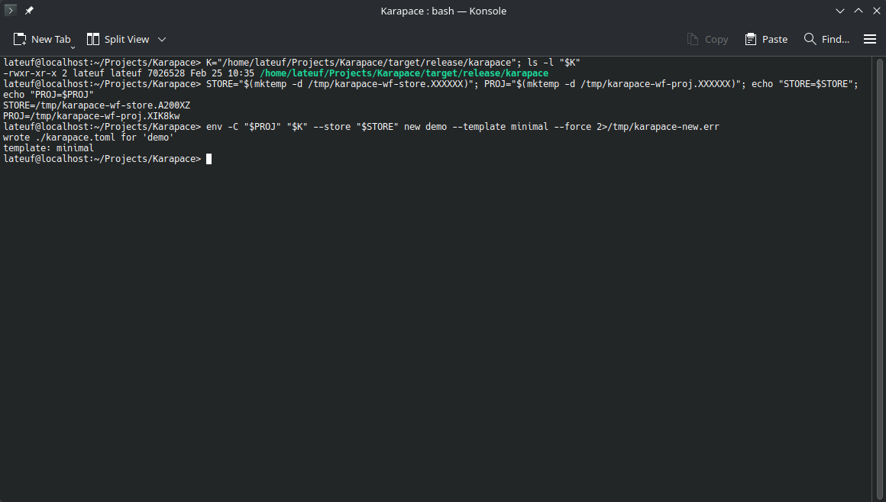
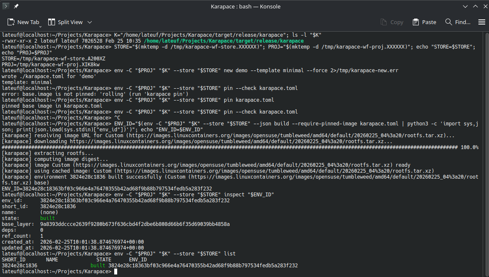

# Karapace

[](https://github.com/marcoallegretti/karapace/actions/workflows/ci.yml)
[](LICENSE)

Deterministic, content-addressed container environments for Linux. No root. No daemon.

Karapace builds isolated development environments from declarative TOML manifests using Linux user namespaces and overlay filesystems. Each environment gets a unique identity (blake3 hash) derived from its fully resolved dependencies.

## Prerequisites

- Linux with user namespaces (`CONFIG_USER_NS=y`)
- `fuse-overlayfs`
- `curl`
- Optional: `crun`/`runc`/`youki` (OCI backend)

Run `karapace doctor` to check.

## Install

```bash
git clone https://github.com/marcoallegretti/karapace.git
cd karapace
cargo build --release
sudo install -Dm755 target/release/karapace /usr/local/bin/karapace
```

Or via cargo:

```bash
cargo install --git https://github.com/marcoallegretti/karapace.git karapace-cli
```

## Usage

```bash
# Create a manifest
cat > karapace.toml << 'EOF'
manifest_version = 1

[base]
image = "rolling"

[system]
packages = ["git", "curl"]

[runtime]
backend = "namespace"
EOF

# Build and enter
karapace build
karapace enter <env_id>

# Run a command
karapace exec <env_id> -- git --version

# Snapshot
karapace commit <env_id>
karapace restore <env_id> <snapshot_hash>
```





See `examples/` for more manifests: `minimal.toml`, `dev.toml`, `gui-dev.toml`, `ubuntu-dev.toml`, `rust-dev.toml`.

## Commands

25 commands. All accept `--store <path>`, `--verbose`, `--trace`. All except `tui` accept `--json`.

```
new <name> [--template] [--force] Generate `karapace.toml`
build [manifest] [--name]       Build environment
rebuild [manifest] [--name]     Destroy + rebuild
enter <id> [-- cmd...]          Enter environment
exec <id> -- <cmd...>           Run command in environment
destroy <id>                    Destroy environment
stop <id>                       Stop running environment
freeze <id>                     Freeze (prevent writes)
archive <id>                    Archive (prevent entry)
list                            List environments
inspect <id>                    Show metadata
diff <id>                       Show overlay changes
snapshots <id>                  List snapshots
commit <id>                     Snapshot overlay
restore <id> <hash>             Restore snapshot
gc [--dry-run]                  Garbage collect
verify-store                    Check store integrity
push <id> [--tag] [--remote]    Push to remote
pull <ref> [--remote]           Pull from remote
rename <id> <name>              Rename environment
doctor                          Check prerequisites
migrate                         Check store version
completions <shell>             Shell completions
man-pages [dir]                 Generate man pages
tui                             Terminal UI
```

## Workspace

9 crates:

```
karapace-schema     Manifest, normalization, lock file, identity
karapace-store      Objects, layers, metadata, WAL, GC, integrity
karapace-runtime    Backends (namespace/oci/mock), images, security
karapace-core       Engine: lifecycle orchestration
karapace-cli        CLI (25 commands)
karapace-dbus       D-Bus service (optional)
karapace-tui        Terminal UI (optional)
karapace-remote     Remote store client, push/pull
karapace-server     Reference HTTP server
```

## Limitations

- Linux only.
- Layer packing drops: extended attributes, device nodes, hardlinks, SELinux labels, ACLs.
- Base images are content-hashed but not GPG-verified.
- No MAC enforcement (SELinux/AppArmor) inside containers.
- Remote protocol has no authentication yet.

## Documentation

- [Getting Started](docs/getting-started.md)
- [Architecture](docs/architecture.md)
- [CLI Reference](docs/cli-reference.md)
- [Storage Format](docs/storage-format.md)
- [Security Model](docs/security-model.md)
- [Build and Reproducibility](docs/build-and-reproducibility.md)
- [Contributing](docs/contributing.md)

## License

[EUPL-1.2](LICENSE)
